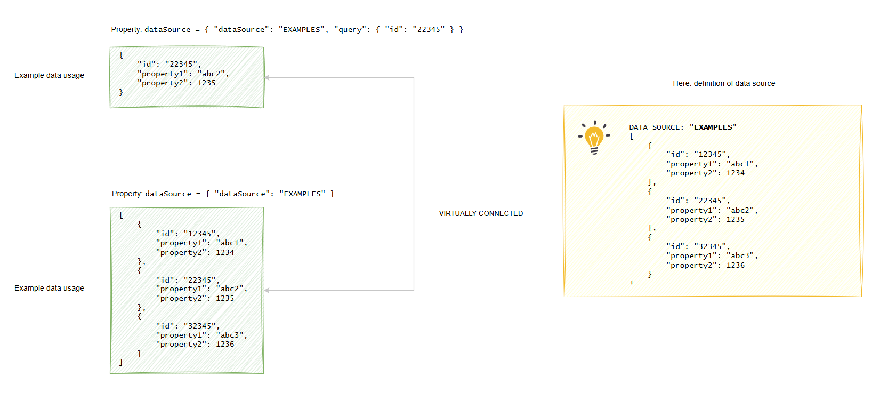

# Summary
This is a very starting point of the draw.io plugin that will allow the user to create a set of JSON data sources in the diagram to reuse them later.

# History
I was using draw.io application for years. Some day I realized that for complex architecture diagrams it is very hard to maintain the data, examples, code parts etc. I was working on documentations created in this tool and the code was changing relatively recently.
The example data as well. Every time I changed the idea or the data models, I had to update all diagrams and pages with new data, adjusting all the things accordingly. It was very time consuming.

# Status
**WAITING**
The plugin is currenlty only a fork from https://github.com/balvanra/draw.io-plugins, no changes made yet.

# Concept
The idea behind this plugin:
* Possibility to create a JSON sets of data (arrays of JSON documents / objects) inside one of the pages
* Reference JSON data sources created on above page by name + query to fetch the particular data (e.g. by ID)
* The JSON Data can be used as ready to use blocks, which have properties e.g. "dataSource" which will contain the simple filter query to fetch data,  e.g.
```
{ "dataSource": "OBJECTS", "query": { "id": "abc223" } }
```
* By updating data source (which can be also a predefined block) we will be able to refresh data in all places without touchig all the places


